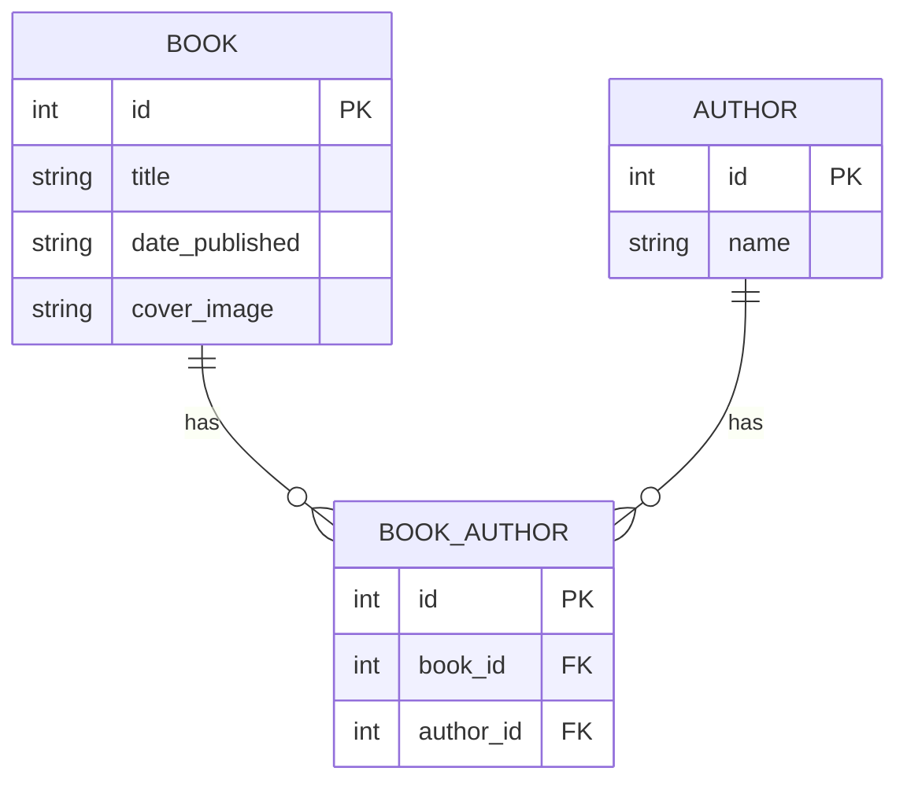

# swift-api-rest

This project implements a simple API just to illustrate how one would go about implementing a REST API using FastAPI and Python. 

Currently for simplicity the database is just one table. However in a real world application there should probably be a separate table for Author and a BookAuthor table that links Books and Authors. See [Additional Considerations](#additional-considerations) below.

## Run

```bash
source configure.sh

./watch.sh
```

Browse the docs and test the API via the Swagger UI:

```bash
open http://127.0.0.1:8001/docs
```

## Updating the code

```bash
source configure.sh
```

Open the project directory in Visual Studio Code:

```bash
code .
```

## Development

Format it with the [black](https://black.readthedocs.io/en/stable/) formatter:

```sh
black .
```

Correct the import order with [isort](https://pycqa.github.io/isort/):

```sh
isort .
```

Run the tests (from the command line):

```sh
pytest
```

Generate test coverage report:

```bash
coverage run -m pytest && coverage combine && coverage report
```

Run tests in multiple python environments (will run for 3.12, 3.11, 3.10):

```sh
hatch run test
```

## Tasks

List tasks:

```bash
inv --list
```

## Run in Podman / Docker 

Rebuild container image and start container:

```bash
inv podman
```

Delete container and image:

```bash
inv podman-delete
```

## Generate API Clients

### Setup

Download `openapi-generator`:

```bash
wget https://repo1.maven.org/maven2/org/openapitools/openapi-generator-cli/7.3.0/openapi-generator-cli-7.3.0.jar --output-document openapi-generator-cli.jar
```

List available generators:

```bash
java -jar openapi-generator-cli.jar list
```

### React / Fetch (TypeScript)

#### Generate `swift-api-rest-react` 

##### Start Server

In Terminal in Visual Studio Code:

```bash
./watch.sh
```

##### Create / Update React client

In separate Terminal:

```bash
inv update-client-react
```

That will generate Fetch Typescript client in `../swift-api-rest-react`. 

##### List config options

```bash
java -jar openapi-generator-cli.jar config-help --generator-name typescript-fetch
```

You can customize the generator by updating the [typescript-react.json](./client/typescript-react.json).

### Angular / HttpClient (TypeScript)

#### Generate `swift-api-rest-ng` 

##### Start Server

In Terminal in Visual Studio Code:

```bash
./watch.sh
```

##### Create / Update Angular client

In separate Terminal:

```bash
inv update-client-ng
```

That will generate Angular Typescript client in `../swift-api-rest-ng`. 

##### List config options

```bash
java -jar openapi-generator-cli.jar config-help --generator-name typescript-angular
```

You can customize the generator by updating the [typescript-ng.json](./client/typescript-ng.json).

## Additional Considerations

In reality a book could be from many Authors and one Author could write several books. This diagram illustrates the database schema:



Below is an example of how you would create a Book with the above schema.

### Database Models

```python
from sqlalchemy import Column, Integer, String, ForeignKey
from sqlalchemy.orm import relationship
from sqlalchemy.ext.declarative import declarative_base

Base = declarative_base()

class BookAuthor(Base):
    __tablename__ = 'book_authors'

    id = Column(Integer, primary_key=True, index=True)
    book_id = Column(Integer, ForeignKey('books.id'))
    author_id = Column(Integer, ForeignKey('authors.id'))

class Book(Base):
    __tablename__ = 'books'

    id = Column(Integer, primary_key=True, index=True)
    title = Column(String, index=True)
    date_published = Column(String)
    cover_image = Column(String)
    book_authors = relationship("BookAuthor", back_populates="book")

class Author(Base):
    __tablename__ = 'authors'

    id = Column(Integer, primary_key=True, index=True)
    name = Column(String, index=True)
    book_authors = relationship("BookAuthor", back_populates="author")

BookAuthor.book = relationship("Book", back_populates="book_authors")
BookAuthor.author = relationship("Author", back_populates="book_authors")
```

### API Models

```python
from pydantic import BaseModel
from typing import List

class AuthorBase(BaseModel):
    name: str

class AuthorCreate(AuthorBase):
    pass

class Author(AuthorBase):
    id: int

    class Config:
        from_attributes = True

class BookBase(BaseModel):
    title: str
    date_published: str
    cover_image: str

class BookCreate(BookBase):
    author_ids: List[int]

class Book(BookBase):
    id: int
    authors: List[Author]

    class Config:
        from_attributes = True

class BookAuthorBase(BaseModel):
    book_id: int
    author_id: int

class BookAuthorCreate(BookAuthorBase):
    pass

class BookAuthor(BookAuthorBase):
    id: int

    class Config:
        from_attributes = True
```

### Example code for creating a book

Use `db.begin()` as a context manager to start a transaction. 
If all operations complete successfully, the transaction is automatically committed. If an exception occurs, the transaction is automatically rolled back.

```python
from sqlalchemy.orm import Session
from sqlalchemy.exc import SQLAlchemyError

def create_book(db: Session, book: BookCreate):
    try:
        with db.begin():
            db_book = Book(title=book.title, date_published=book.date_published, cover_image=book.cover_image)
            db.add(db_book)
            db.flush() # this assigns an id to db_book

            for author_id in book.author_ids:
                db_book_author = BookAuthor(book_id=db_book.id, author_id=author_id)
                db.add(db_book_author)

        db.refresh(db_book)
        return db_book
    except SQLAlchemyError:
        db.rollback()
        raise
```

## License

`swift-api-rest` is distributed under the terms of the [Apache 2.0 ](https://spdx.org/licenses/Apache-2.0.html) license.
